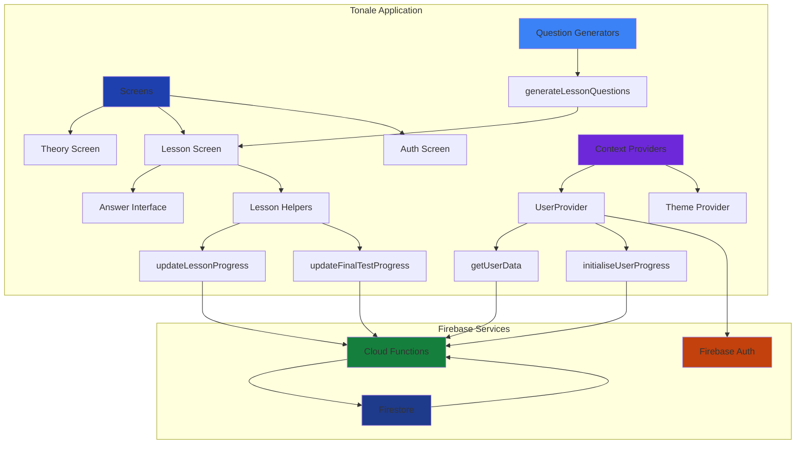
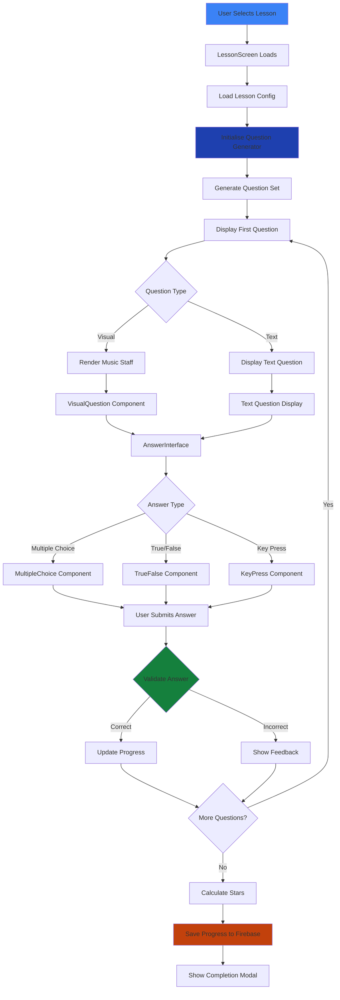

# Tonale


A React Native music theory learning application built with Expo.

**Design:** [Figma Design](https://www.figma.com/design/e7W92MCER7LJqvN32p9iL6/Tonale?node-id=0-1&p=f&t=iZkiu1O4a1c1hPtY-0)

## Overview

Tonale is a music theory learning platform that provides structured lessons aligned with ABRSM Grade 1-5 curriculum. The application features interactive question generation, visual music notation rendering, and progress tracking.

### Key Features

- Three stages with 24+ lessons (Pre-Grade Introduction, Foundation, Complete Grade 1)
- Question types: multiple choice, true/false, key press
- Custom music notation rendering (`@leonkwan46/music-notation`)
- Lesson progress tracking with star ratings
- Light/dark mode support
- Unit tests (Jest) and E2E tests (Maestro)

## Documentation

Additional project documentation is available in the [`docs/`](./docs/) folder:

- **[Grade-Syllabus.md](./docs/Grade-Syllabus.md)** - ABRSM-style summary of Grades 1–3 curriculum requirements, covering terms, signs, clefs, time signatures, pitches, scales, intervals, triads, and more
- **[App-Stage-Syllabus.md](./docs/App-Stage-Syllabus.md)** - Detailed application stage syllabus with lesson breakdowns organised by stages (Pre-Grade, Grade 1, Grade 2, Grade 3)
- **[Stage-Syllabus-Gap-Analysis.md](./docs/Stage-Syllabus-Gap-Analysis.md)** - Comprehensive analysis identifying missing topics compared to ABRSM requirements, with priority recommendations
- **[Music_Theory_Qual_Spec_April_2023_2023_rebrand.pdf](./docs/Music_Theory_Qual_Spec_April_2023_2023_rebrand.pdf)** - Official ABRSM Music Theory Qualification Specification reference document

## Architecture Overview



## Tech Stack

**Core Technologies:**
- **React Native** + **Expo** - Cross-platform mobile development
- **TypeScript** - Type-safe development with strict mode
- **Firebase** - Authentication, Firestore, and Cloud Functions
- **Expo Router** - File-based routing with type-safe navigation

**Testing:**
- **Jest** - Unit testing for exercise generators and music theory utilities
- **Maestro** - E2E testing for complete user flows


**Music Notation (Custom Implementation):**
- **@leonkwan46/music-notation** - Custom music notation rendering library for React Native
- Enables rendering of music staffs, notes, rests, time signatures, key signatures, and articulation marks

**Example Usage:**
```typescript
import { MusicStaff, NoteType } from '@leonkwan46/music-notation'

// Render a treble clef staff with a C major scale
<MusicStaff
  clef="treble"
  timeSignature={{ numerator: 4, denominator: 4 }}
  keyName="C"
  size="med"
  elements={[
    [{ pitch: 'C4', type: NoteType.CROTCHET }],
    [{ pitch: 'D4', type: NoteType.CROTCHET }],
    [{ pitch: 'E4', type: NoteType.CROTCHET }],
    [{ pitch: 'F4', type: NoteType.CROTCHET }],
  ]}
  showStaff={true}
/>
```


## Project Structure

### Key Directories

- **`app/`** - Expo Router file-based routing structure
  - `(auth)/` - Authentication flow screens
  - `(tabs)/` - Main application tabs (Home, Theory, Aural, Settings)
  - `lesson.tsx` - Dynamic lesson screen route

- **`src/screens/`** - Screen components organised by feature
  - Each screen has its own directory with `index.tsx` and `.styles.ts` files
  - Follows separation of concerns with components in subdirectories

- **`src/theory/`** - Core music theory logic
  - `curriculum/` - Lesson definitions and stage configurations
  - `exercises/generators/` - Question generation algorithms
  - `exercises/custom/` - Specialised question types
  - `utils/` - Music theory utilities (scales, intervals, triads)

- **`src/sharedComponents/`** - Reusable UI components
  - `containers/` - Context providers and layout components
  - Individual component directories with styles

- **`src/config/`** - Configuration files
  - `firebase/` - Firebase initialization and function wrappers
  - `gradeSyllabus/` - ABRSM curriculum data

- **`functions/`** - Firebase Cloud Functions
  - `lessonProgress/` - Lesson progress CRUD operations
  - `userData/` - User profile management

- **`tests/`** - Test suites
  - `unit/` - Jest unit tests for exercise generators
  - `e2e/` - Maestro E2E test flows

## Development Setup

### Installation

1. **Clone the repository**
   ```bash
   git clone https://github.com/leonkwan46/tonale.git
   cd tonale
   ```

2. **Required Configuration Files & Credentials**
   
   Contact **[leonkwan46](https://github.com/leonkwan46)** to obtain:
   - **GitHub token** for npm authentication (required for `@leonkwan46/music-notation` package)
   - **Firebase configuration files**: `google-services.json` (Android), `GoogleService-Info.plist` (iOS)
   - **`.env` file** with Firebase environment variables
   
   Configure npm authentication:
   ```bash
   echo "//npm.pkg.github.com/:_authToken=YOUR_GITHUB_TOKEN" >> ~/.npmrc
   echo "@leonkwan46:registry=https://npm.pkg.github.com" >> ~/.npmrc
   ```

3. **Install dependencies**
   ```bash
   npm install
   ```

4. **Start Firebase Emulators** (for local development)
   ```bash
   npm run firebase
   ```
   Starts Firebase Auth (port 9099), Firestore (port 8080), and Functions (port 5001) emulators.

5. **Start Development Server**
   ```bash
   npm start
   ```

## Architecture Deep Dive

### Lesson Execution Flow



**Question Generation:**
- Generators in `src/theory/exercises/generators/` create questions based on lesson type
- Each generator implements a consistent interface returning `Question` objects
- Visual components render music notation using `@leonkwan46/music-notation` library
- Answer validation happens client-side with server-side progress tracking

---

## License

Private project - All rights reserved
