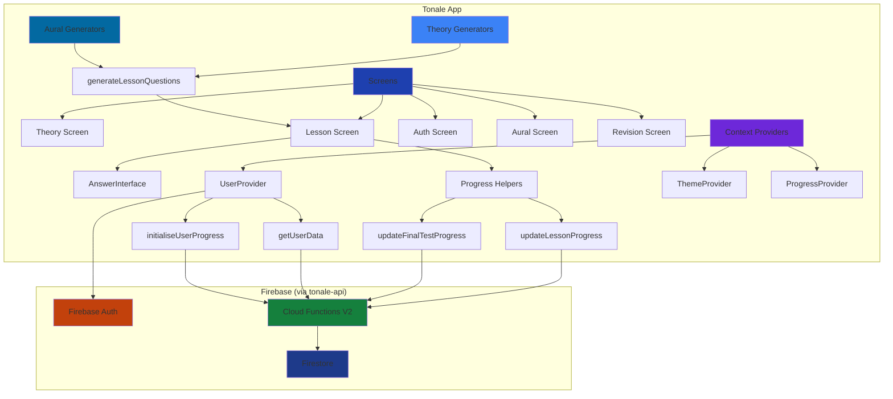
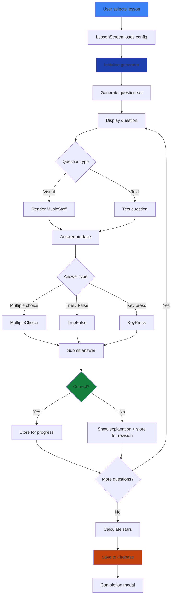

# Architecture

Technical overview of how Tonale is structured, how lessons work, and how the pieces connect.

---

## Tech stack

| Layer | Technology |
|---|---|
| Framework | React Native + Expo (~54) |
| Language | TypeScript (strict) |
| Routing | Expo Router (file-based) |
| State | React Context (User, Theme, Progress) |
| Backend | Firebase Auth, Firestore, Cloud Functions |
| Notation | `@leonkwan46/music-notation` (custom RN library) |
| Function types | `@leonkwan46/functions` (shared callable contracts) |
| Styling | Emotion Native |
| Unit tests | Jest + ts-jest |
| E2E tests | Maestro |

---

## System overview



---

## Project structure

```
tonale/
├── app/                        # Expo Router file-based routes
│   ├── (auth)/                 # Auth flow (sign in, sign up)
│   ├── (tabs)/                 # Main tab navigator
│   │   ├── index.tsx           # Home
│   │   ├── theory.tsx          # Theory subject entry
│   │   ├── aural.tsx           # Aural subject entry (feature-flagged)
│   │   └── settings/           # Settings stack (account, privacy, feedback, donation)
│   ├── lesson.tsx              # Lesson screen (theory + aural)
│   ├── revision.tsx            # Revision session screen
│   ├── onboarding.tsx          # First-run onboarding
│   └── auth-action.tsx         # Email action handler (verify, reset)
│
├── src/
│   ├── subjects/
│   │   ├── theory/             # Theory subject
│   │   │   ├── curriculum/     # Stage configs (stageZero, stageOne, stageTwo) + types
│   │   │   └── exercises/
│   │   │       ├── generator.ts        # Main dispatcher
│   │   │       ├── generators/         # 15 topic generators (see below)
│   │   │       ├── custom/             # Grouping + tieSlur (need visual/interactive logic)
│   │   │       ├── explanation/        # Per-topic wrong-answer explanations
│   │   │       └── utils/              # Shared exercise utilities
│   │   └── aural/              # Aural subject
│   │       ├── curriculum/     # Aural stage configs
│   │       ├── exercises/      # Rhythm generators, playback logic
│   │       └── generators/     # Aural-specific question generators
│   │
│   ├── screens/                # Screen components (one folder per route)
│   ├── sharedComponents/       # Reusable UI components
│   ├── globalComponents/       # App-wide wrappers (modals, overlays)
│   ├── config/
│   │   ├── firebase/           # Firebase client init + emulator wiring (__DEV__)
│   │   │   └── functions/      # Thin callers for Cloud Functions (userData, lessonProgress, revisionQuestions)
│   │   ├── gradeSyllabus/      # ABRSM curriculum data
│   │   ├── theme/              # Design tokens (palette, dimensions, contrast), components, theme assembly
│   │   └── environment.ts      # Env config helper (dev / staging / production)
│   ├── hooks/                  # Custom React hooks
│   ├── types/                  # Shared TypeScript types
│   └── utils/                  # General utilities
│
├── tests/
│   ├── unit/exercises/generators/   # Jest tests — one file per generator
│   └── e2e/                         # Maestro YAML flows (stage-0, stage-1, stage-2)
│
└── scripts/
    ├── check-case-sensitivity.sh    # Guards against import-casing bugs (runs in CI)
    └── run-e2e-tests.sh             # Maestro runner helper
```

> **Backend is separate.** Cloud Functions, Firestore rules, and the Firebase emulator setup live in **[tonale-api](https://github.com/leonkwan46/tonale-api)**.

---

## The two subject tracks

### Theory

Covers ABRSM note values, clefs, accidentals, time signatures, key signatures, scales, intervals, triads, and Italian terms across Stages 0–2.

**15 question generators:**

| Generator | Topics |
|---|---|
| `noteValueName` / `noteRestValue` | Semibreve → semiquaver names and beat values |
| `restValueName` | Rest identification |
| `noteIdentification` | Staff note reading (treble + bass clef) |
| `accidentals` | Sharps, flats, naturals |
| `timeSignature` | Simple and compound time signatures |
| `keySignature` | Major key signatures (C, G, D, F…) |
| `scaleDegrees` | Degrees 1–8 in C, G, D, F Major |
| `interval` | Intervals 2nd–8ve |
| `triad` | Root-position tonic triads |
| `semitonesTones` | Half steps and whole steps |
| `dottedValue` | Dotted note/rest values |
| `grouping` | Note beaming in simple time |
| `tieSlur` | Tie vs slur identification |
| `musicalTerm` | Italian tempo and expression terms |

### Aural

Covers rhythm recognition and pulse through a dedicated **RhythmTap** interface with native audio playback. Aural has its own curriculum, generators, and exercise engine under `src/subjects/aural/`.

---

## Lesson execution flow



Wrong answers are stored via `storeRevisionQuestionV2` so they surface in **Revision mode** — a separate screen that replays only the questions the user got wrong.

---

## Firebase wiring

The app talks to Firebase through **callable Cloud Functions V2**. In `__DEV__`, calls are routed to the local emulators:

| Emulator | Port | Android host | iOS host |
|---|---|---|---|
| Auth | 9099 | `10.0.2.2` | `localhost` |
| Functions | 5001 | `10.0.2.2` | `localhost` |
| Firestore | 8080 | `10.0.2.2` | `localhost` |

**Callable functions used:**

| Module | Functions |
|---|---|
| User data | `createUserDataV2`, `getUserDataV2`, `updateUserDataV2`, `deleteUserDataV2` |
| Lesson progress | `updateLessonProgressV2`, `getLessonProgressV2`, `getAllLessonProgressV2`, `deleteLessonProgressV2` |
| Revision questions | `storeRevisionQuestionV2`, `getRevisionQuestionsV2`, `deleteRevisionQuestionV2`, `deleteRevisionQuestionsV2`, `deleteRevisionQuestionsByLessonV2` |

---

## Custom notation library

`@leonkwan46/music-notation` renders music notation entirely in React Native (no WebView). Example usage in a theory question:

```typescript
import { MusicStaff, NoteType } from '@leonkwan46/music-notation'

<MusicStaff
  clef="treble"
  timeSignature={{ numerator: 4, denominator: 4 }}
  keyName="C"
  size="med"
  elements={[
    [{ pitch: 'C4', type: NoteType.CROTCHET }],
    [{ pitch: 'D4', type: NoteType.CROTCHET }],
    [{ pitch: 'E4', type: NoteType.CROTCHET }],
    [{ pitch: 'F4', type: NoteType.CROTCHET }],
  ]}
  showStaff={true}
/>
```

---

## Testing strategy

### Unit tests (Jest)

Every question generator has a dedicated test file under `tests/unit/exercises/generators/`. Tests verify that generators return correctly shaped `Question` objects, cover edge cases, and don't produce invalid answers.

```bash
npm test               # run all
npm run test:coverage  # with coverage report
```

### E2E tests (Maestro)

23 YAML flows covering every lesson in Stages 0–2, plus revision and account helpers:

| Stage | Flows |
|---|---|
| Stage 0 (Pre-grade) | 7 lessons + final test |
| Stage 1 (Foundation) | 6 lessons + final test |
| Stage 2 (Complete Grade 1) | 7 lessons + final test |
| Helpers | `createAccount`, `loginAccount`, `revision-test` |

```bash
npm run test:e2e          # all stages
npm run test:e2e:stage0   # pre-grade
npm run test:e2e:stage1   # stage 1
npm run test:e2e:stage2   # stage 2
```

---

## CI / CD

| Workflow | Trigger | What it does |
|---|---|---|
| `qa-checks` | Push / PR to `main` or `staging` | Case-sensitivity check, lint, TypeScript, Jest, functions type-check |
| `android-build` | Push / PR to `main` or `staging`, or manual dispatch | Expo prebuild → Gradle assembleRelease + bundleRelease; uploads APK/AAB artifacts on manual dispatch only |
